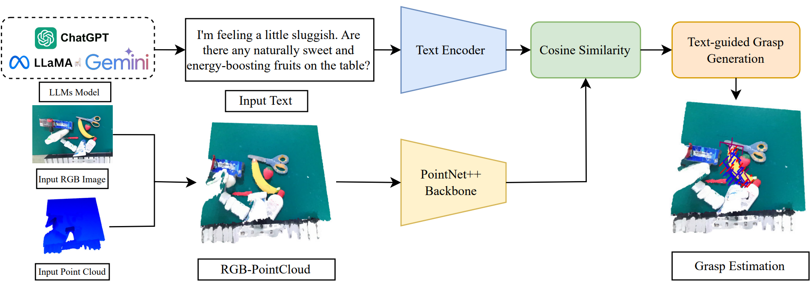

# MODEL Text-Guided-RGBP-grasp-Generation-simulation
[[dataset_visual](https://graspnet.net/)]
[[dataset_text](https://drive.google.com/file/d/1AtoURfvkvyOg2I3drIEPsFYUtH7mKCTc/view?usp=sharing)]



## Demo


## Requirements
- Python 3
- PyTorch 2.3.0
- Open3d >=0.8
- TensorBoard 2.3
- NumPy == 1.24.4
- SciPy
- Pillow
- tqdm

## Installation
Get the code.
```bash
git clone https://github.com/Thiep1808/Text-Guided-RGBP-grasp-Generation.git
cd Text-Guided-RGBD-grasp-Generation-simulation
```
Install packages via Pip.
```bash
pip install -r requirements.txt
```
Compile and install pointnet2 operators (code adapted from [votenet](https://github.com/facebookresearch/votenet)).
```bash
cd pointnet2
python setup.py install
```
Compile and install knn operator (code adapted from [pytorch_knn_cuda](https://github.com/chrischoy/pytorch_knn_cuda)).
```bash
cd knn
python setup.py install
```
Install graspnetAPI for evaluation.
```bash

cd graspnetAPI
pip install .
```
## Tolerance Label Generation
```bash
cd dataset
python generate_tolerance_label.py
```
## Input Data Structure
├── Data                  
│   ├── grasp_label      
│   ├── collision_label          
│   ├── scenes      
│   └── text_data   
         
## Training and Testing
The training examples --dataset_root, --camera, and --log_dir should be specified according to your settings. You can use TensorBoard to visualize the training process.

The testing examples contain inference and result evaluation. The parameters --dataset_root, --camera, --checkpoint_path, and --dump_dir should be specified according to your settings. Set --collision_thresh to -1 for faster inference.

The pretrained weights can be downloaded from:

- `checkpoint-kn.tar`
[(https://drive.google.com/file/d/1hd0G8LN6tRpi4742XOTEisbTXNZ-1jmk/view?usp=sharing](https://github.com/Thiep1808/Text-Guided-RGBP-grasp-Generation/tree/main/logs)]

`checkpoint-kn.tar` is trained using Kinect data respectively.
## Demo
A demo program is provided for grasp detection and visualization using RGB-P images and Text. You can refer to the instructions below to run the program. The --checkpoint_path must be specified according to your installation. The output should be similar to the following example:
```bash
python demo.py
```
<div align="center">    
    
</div>

RGB-P images and camera intrinsics are required for inference. The factor_depth parameter stands for the scale for depth values to be transformed into meters. You can also add a workspace mask for denser output.


